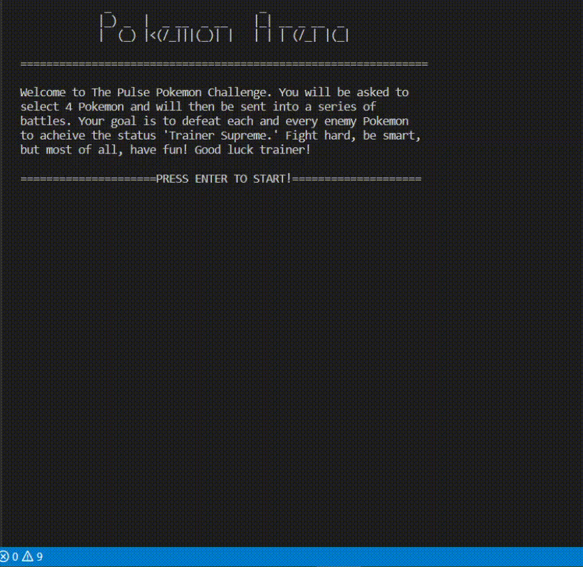
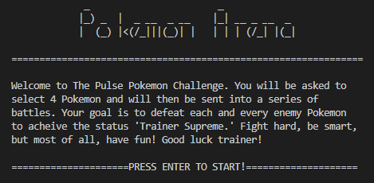
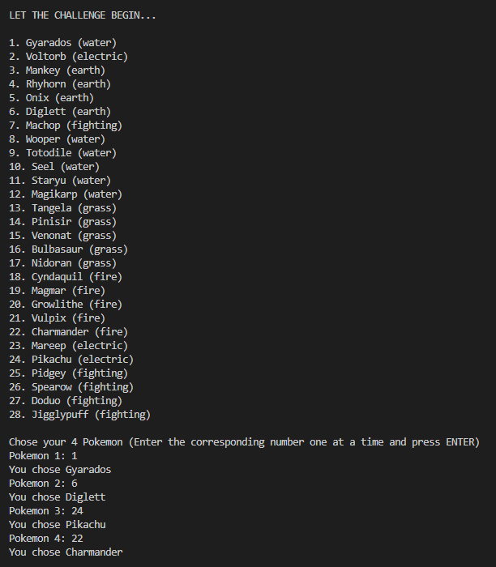
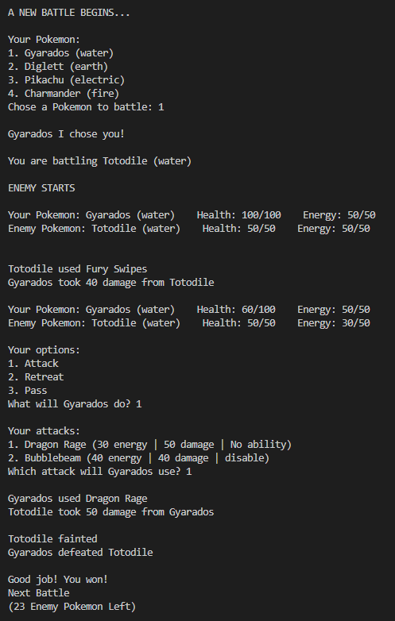

# Pokemon Text

Exploring object-oriented programming with Pokemon! ([Demo Video](https://youtu.be/FafhZfWszrM))

Course: Computer Science  ICS4U (Grade 12)  
Date: January 8th, 2017  
Grade: 100%

## Table of Contents
[1. Intro](#Intro)  
[2. Gameplay](#Gameplay)  
[3. Environment Setup](#Environment-Setup)  
[4. How to Play](#How-to-Play)  
[5. Results](#Results)  
[6. Next Steps](#Next-Steps)

## Intro

A text-based Pokemon battling game with the command line. Utilizes Java, object-oriented programming and other ICS4U computing techniques.

Detailed information on this project can be found in the [Pokemon Doc PDF](Pokemon%20Arena.pdf)

## Gameplay

Check out the demo video for this project [here](https://youtu.be/FafhZfWszrM)!

  
  

## Environment Setup

To successfully run this project, please follow these steps to set up your environment:

1. Any IDE that runs Java (I recommend [IntelliJ IDEA](https://www.jetbrains.com/idea/), [JCreator](https://www.deepcrazyworld.com/how-to-download-jcreator-pro/) or [VS Code](https://code.visualstudio.com/download))
2. Java SE 8 (which includes JDK 1.8.0_333) ([Download from Oracle](https://www.oracle.com/java/technologies/javase/javase8u211-later-archive-downloads.html))
3. Ensure your IDE is configured to use the above version of Java SE and JDK

## How to Play

All commands of this game are made through the command line of your IDE.

Follow the prompts, type a number, and press enter to make a choice!

To customize the game and add your own Pokemon, edit the [pokemon.txt](pokemon.txt) file before running the program.

Run the [PokemonArena.java](PokemonArena.java) file to play!

## Results

Participating in this Pokemon project was enjoyable as I was able to take a deep dive into Java, object-oriented programming, and other computing science concepts.

I learned a lot and am excited to put the knowledge gained from this experience to further use.

**Grade: 100%**

## Next Steps

Some fun things I would like to build on or explore relating to this project would be:

- Add graphics (i.e. battle scene) to the program
- Create more advanced/sophisticated enemy logic
- Add various difficulties
